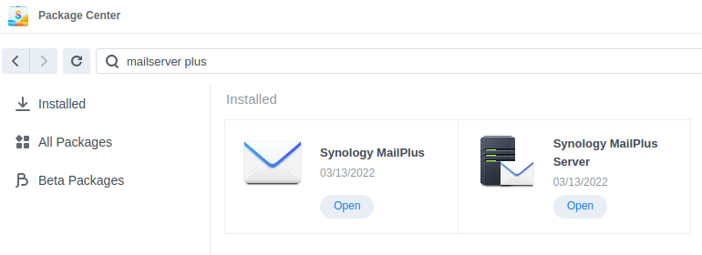
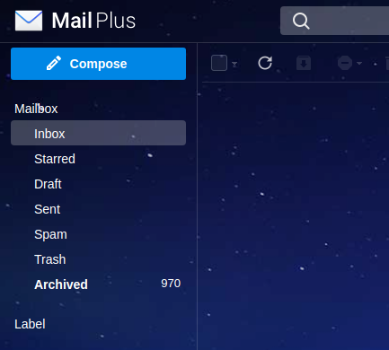

<!--more-->

 I've used gmail since the beta launched touting a whopping 1GB of storage. I thought this was a massive leap in email technology at the time. I was lucky enough to get an invite fairly quickly. Not suprisingly, I have many years of emails, attachments, and photos. I certainly do not want to lose the content of many of these emails. Despite the redundancy of the data that Google secures, I still feel better retaining a copy of this data on my own physical machines.

The thought of completely de-googling has crossed my mind on occassion. Convenience, coupled with my admiration for Google engineering, has prevented me from doing so thus far. Though, I may end up doing so at some point in the future.

## Synology MailPlus Server

Synology products are reasonably priced for what you get (essentially a cloud-in-a-box) and there is very little maintenance required. I've recently been in interested in syncing and snapshotting my personal data. I've setup [Synology's Cloud Sync](https://www.synology.com/en-ca/dsm/feature/cloud_sync) and keep copies of most of my cloud data.

 I've used tools such as [gmvault](http://www.gmvault.org) with success in the past. Setting this up on a cron seems like a viable option. However, I don't really need a lot of the features it offers and do not plan to restore this data to another account.

Synology's MailPlus seems to be a good candidate for backing up this data. By enabling POP3 fetching, it's possible to fetch all existing emails, as well as periodically fetch all new emails. If a disaster ever did occur, having these emails would be beneficial, as they are an extension of my memory bank.

Installing MailPlus can be done from the Package Center:

Next, I went into **Synology MailPlus Server** and on the left, clicked on **Account** and ensured my user was marked as active.

Afterwords, I followed [these instructions](https://kb.synology.com/en-in/DSM/tutorial/How_should_I_receive_external_email_messages_via_MailPlus) in order to start backing up emails.

When entering the POP3 credentials, I created an [app password](https://myaccount.google.com/apppasswords) solely for authenticating to POP3 from the Synology device. This is required because I have 2-Step verification enabled on my account. There doesn't seem to be a more secure way to access POP3 at the moment. It does seem like app password access is limited in scope (when MFA is enabled). These app passwords can't be used to login to the main Google account.

I made sure to set the `Fetch Range` to `All` in order to get all emails from the beginning of time.

After this, mail started coming in.

 After fetching 19 years worth of emails, I tried searching for some emails. It only took a few seconds to search through ~50K emails, which is a relief if I ever did have to search for something important.

## Securing Synology

Since Synology devices are not hermetically sealed, it's best to secure them by [enabling MFA](https://kb.synology.com/en-us/DSM/tutorial/How_to_add_extra_security_to_your_Synology_NAS#x_anchor_id8) to help prevent being the [victim of ransomware](https://www.bleepingcomputer.com/news/security/qlocker-ransomware-returns-to-target-qnap-nas-devices-worldwide/). It is also wise to backup your system settings and volumes to the cloud using a tool such as [Hyper Backup](https://www.synology.com/en-ca/dsm/feature/hyper_backup).
Encrypting your shared volumes should also be done, since unfortunately [DSM does not support full disk encryption](https://community.synology.com/enu/forum/12/post/144665).

## Summary

Having backups of various forms of cloud data is a good investment, especially in [times of war](https://en.wikipedia.org/wiki/2022_Ukraine_cyberattacks). I certainly feel more at ease for having backed up my emails.
